# Mechanical Hashing for Similarity (mechHS) Repository

[](https://www.python.org/)
[](https://github.com/sandialabs/sibl#license)

## Table of Contents
* [Project Background and Summary](#summary)
* [Project Roadmap](#roadmap)
* [Installation Instructions](#install)
* [Tutorial](#tutorial)
* [Reproduce the Results in Our Paper](#reproduce)
* [References to Related Work](#references)
* [Contact Information](#contact)

## Project Background and Summary <a name="summary"></a>
The goal of this project is to establish a proof of concept and introduction to **mech**anical **H**ashing for **S**imiilarity (mechHS). We believe that this framework is simple yet potentially powerful -- the introduction is as follows:

### General Concept of Hashing

Very broadly speaking, a [hash function](https://en.wikipedia.org/wiki/Hash_function) is a function that converts data of an arbitrary size (e.g., a text string, a python file, an audio clip etc.) into a hash of a fixed size (e.g., 32-digit hexadecimal numbers, 40-digit hexadecimal numbers). For example, on a standard laptop, we can use the [md5 algorithm](https://en.wikipedia.org/wiki/MD5) to convert the string "mechHS GitHub Repository" to a 32-digit hexadecimal number as follows:
```bash
(base) macbook-pro:~ emma$ echo -n mechHS GitHub Repository | md5
fcfedafb146ba97b64dbc3d5de36e400
```
For many applications (e.g., storing passwords) hash functions are most useful if they are: (1) irreversible/ near impossible to map from outputs $\mapsto$ inputs, and (2) collision free/ nearly collison free. **Collisions** occur when different inputs map to identical outputs. For example, no text string other than ``mechHS GitHub Repository`` should map to ``fcfedafb146ba97b64dbc3d5de36e400``. For the md5 algorithm and most cryptographic hashes, small changes to the inputs result in large changes to the output. For example, see what happens when we make the work ``repository`` lowercase:
```bash
(base) macbook-pro:~ emma$ echo -n mechHS GitHub repository | md5
190db853ae15d692c412d9f3dcecb454
```

<p align = "center">
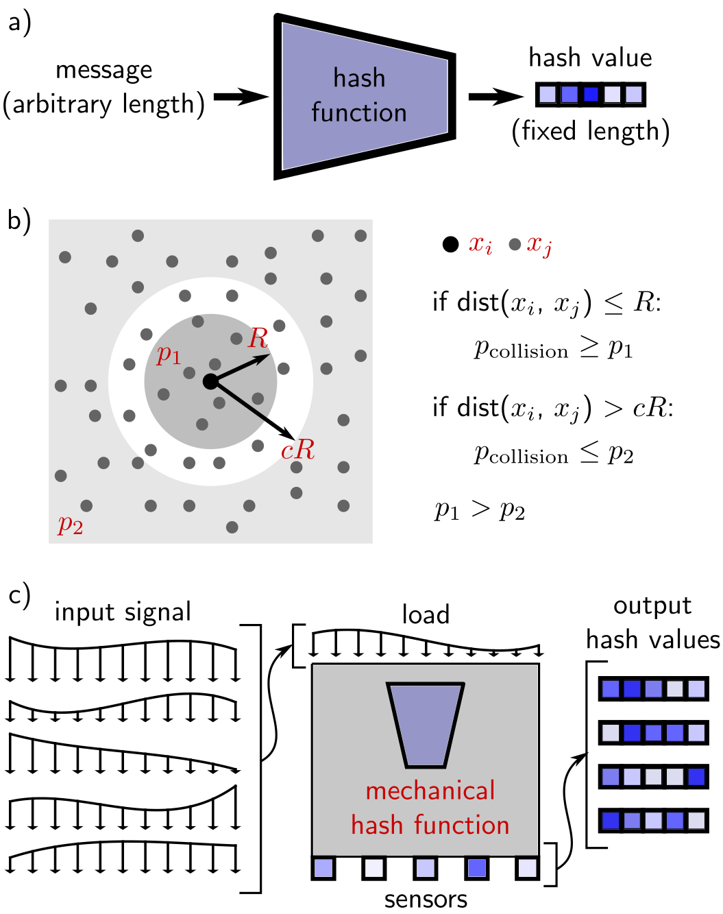
</p>

### General Concept of Hashing for Similarity

The behavior of ``md5`` shown above is desirable for many applications in security. However, if our goal was to use the hash-based fixed dimensional data representation to perform similarity search, the ``md5`` behavior shown above would not be desirable. Instead, we would want a hash algorithm where similar inputs end up as similar (or potentially identical) hashes. Rather than minimizing **collisions**, these algorithms may maximize **collisions**. One example of this approach is [Locality-Sensitive Hashing](https://en.wikipedia.org/wiki/Locality-sensitive_hashing). Developing different (often machine learning) based approaches to this task is also an active area of research. Once hashing is performed with these functions, it is possible to use the transformed data for applications such as similarity search or clustering.

### Mechanical Hashing for Similarity

In general, we can define an item $\mathbf{x}$, a hash function $h(\cdot)$, and a hash value $\mathbf{y}=h(\mathbf{x})$. In this project, our goal is to introduce the concept of hash functions $h(\cdot)$ that are computed via physical mechanical devices. We can think of $\mathbf{y}=h(\mathbf{x})$ as a mechanics based transformation of an input $\mathbf{x}$ (e.g., an applied load or boundary condition) to a fixed dimension output $\mathbf{y}$ (e.g., an observed displacement or sensor readout). Designing the behavior of the hash function $h(\cdot)$ then becomes a problem of designing a physical mechanical device. Notably, non-linear mechanical behavior will correspond to a non-linear hash function, and the potential design space of these physical mechanical devices is massive. We will refer to this concept as **mech**anical **H**ashing for **S**imilarity because we will be focusing on the goal of converting mechanical signals $\mathbf{x}$ to hash values $\mathbf{y}$ where similar signals result in similar hash values.

#### Introduction by Toy Example

As a first toy example, we can define our mechHS hash function as a simply supported beam with an applied distributed load:

<p align = "center">
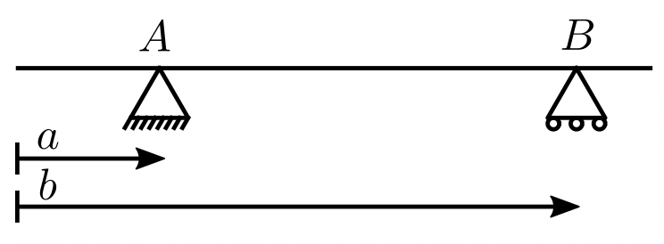
</p>

In this case, a free body diagram and some simple math gives us the mapping $w(x) \mapsto [A_{y}, B_{y}]$
Clearly, all loads $w(x)$ that have the same resultant force $F_R = \int_0^L w(x) \mathrm{d} x$ and centroid $\bar{x} = \int_0^L x  w(x) \mathrm{d} x / \int_0^L w(x) \mathrm{d} x$ will experience a **collision**, and systems with similar $F_R$ and $\bar{x}$ will be hashed to similar values.

The simply supported beam introduced above is a "good" hash function if all you care about is a distributed load's resultant force and centroid. However, we may want different functionality. For example, we may want to delineate between multiple different types of distributed loads that all have the same $F_R$ and $\bar{x}$ but are otherwise different. However, we can design a different mechanical structures that will be better at delineating different inputs. For example, we can consider a composite simply supported beam with three supports:

<p align = "center">
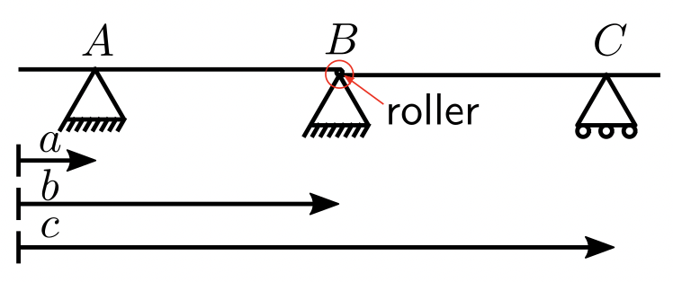
</p>

The mapping for this structure, $w(x) \mapsto [A_{y}, B_{y}, C_{y}]$ will likely lead to fewer **collisions**. Critically, we are not restricted to simply supported beams. The mechanical systems used in this framework can be arbitrarily complex. As another simple example, we can consider an architected domain like this one:

<p align = "center">
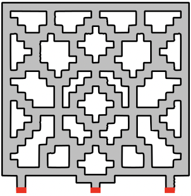
</p>

Overall, there is a massive design space of possibilities. If we subsequently apply a clustering algorithm to these hash values, we can imagine the mechHS device as a "*physical computational layer*" that sits between our inputs (e.g., the applied distributed load) and our outputs (e.g., distributed load class). Building on these simple examples, we can design mechHS devices for more complicated tasks. Specifically, we can modify the mechHS device to follow a more complex and load-dependant non-linear mechanical mechanism, and we can modify the "sensors" for additional readout.

## Project Roadmap <a name="roadmap"></a>

We plan to conduct substantial future research on this topic and establish application driven collaborations in both robotics and bioengineering. Parallel roadmaps for this endeavor are as follows:

🌱 `Proof of Concept` $\mapsto$ `Physical Realization of Application Specific mechHS Devices` $\mapsto$ `Fundamental Understanding of mechHS in the Context of Robotics and Bio-Inspired Systems` $\mapsto$ `Application Driven mechHS Device Optimization` $\mapsto$ `Novel mechHS Enabled Soft Robotics Control` $\mapsto$ `Mechanics/Robotics Collaborations` 🌳

🌱 `Proof of Concept` $\mapsto$ `Computational Realization of Biological System Specific mechHS Motifs` $\mapsto$ `Fundamental Understanding of mechHS in the Context of Biological Systems` $\mapsto$ `Identifying and Probing mechHS Motifs in Biological Systems` $\mapsto$ `Mechanics/Mechanobiology Collaborations` 🌼

Because the goal of this project is to build towards collaborative research, we will aim to keep making general audience tutorials as we go.

## Installation Instructions <a name="install"></a>

For this project, we use the open source Finite Element Analysis (FEA) software [FEniCS](https://fenicsproject.org/download/archive/) to design our mechHS devices. There are many ways to get started with FEniCS on your own computer -- here are instructions for installing FEniCS and the other Python packages needed to run our code:

1. Download our code from GitHub and navigate in terminal to the the repository location.


2. Install FEniCS with a [docker](https://www.docker.com/products/personal/) container (you must be running Docker Desktop or equivalent):

```bash
docker run -ti -v $(pwd):/home/fenics/shared --name fenics-container quay.io/fenicsproject/stable
```

3. Install additional Python packages:

```bash
pip install pathlib --user

pip install perlin-noise --user

pip install -U scikit-learn --user
```

Please note that we are sharing our code here to ensure reproducibility of the results presented in our pre-print and to enable others to build on our work in new directions. Unlike many of our other [repositories](https://github.com/elejeune11/), our goal here is not to provide "user friendly" fully automated software.

## Tutorial <a name="tutorial"></a>

Once FEniCS is installed, additional Python packages are installed, and our code is downloaded from GitHub, running our code should be straightforward. In this tutorial, we will place our emphasis on instructions for extending our work by designing a new mechHS device for testing.

### Design your own mechHS device

This part of our Tutorial is also documented in the file ``tutorial_example.py`` in the ``tutorial`` folder which serves as a companion to the following description and contains the code to generate all of the figures shown in this Section. We can run the whole tutorial at once by navigating to the ``tutorial`` folder and typing:
```bash
fenics@8835588d5a77:~/shared/mechHS/code$ python3 tutorial_example.py
```
Each step in the tutorial is detailed as follows:

1. **Define a blank grid** by specifying the number of rows and number of columns desired:
```bash
num_grid_row = 25
num_grid_col = 25
fname = "grid_25x25"
mg.create_blank_grid(mypath, num_grid_row, num_grid_col, fname_grid)
```
The 25x25 grid specified above will look like this:
<p align = "center">
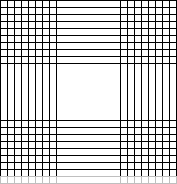
</p>
with a 25x25 grid outlined in gray with one extra rows (1x25) appended on the bottom.

2. **Draw a mechHS device** by importing the ``grid_25x25.png`` file to an image editor (e.g., [Inkscape](https://inkscape.org/)) and using the paint bucket tool to indicate structure with the color red ``RGB: [255, 0, 0]`` and indicate boundary conditions (fixed in x and y) with the color black ``RGB: [0, 0, 0]`` like this example:

<p align = "center">
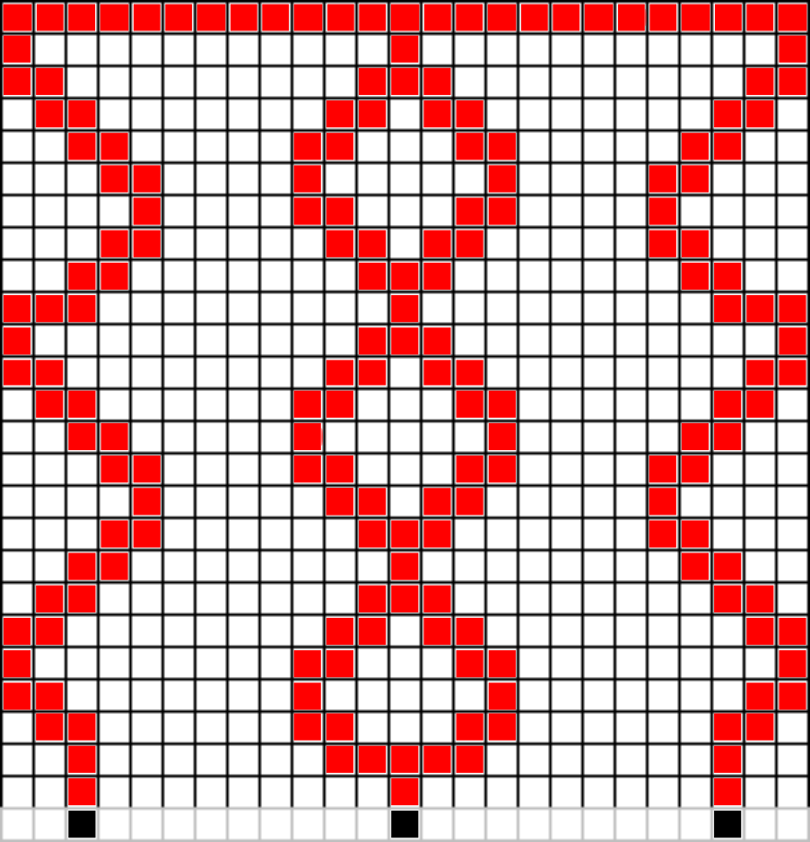
</p>

Once the structure is designed, save the results as a png (with no surrounding whitespace) and make sure it is saved in the ``FEA_mesh`` folder as follows:
```bash
|___ code
|        |___ FEA_mesh
|                |___"grid_25x25.png"
|                |___"tutorial_example.png"
```
Note that for the FEA code here, the top row of the grid should be filled in as the distributed load is applied to the top layer, and the structure should be fully connected between the top and the bottom of the domain where the boundary conditions are applied.

3. **Import the mechHS drawing and create a FEA mesh** by converting the ``tutorial_example.png`` file to arrays that describe the geometry as follows:
```bash
fname = "tutorial_example"
mesh_param = 200
row_dim = 10
col_dim = 10
geom_mat, xx_sensor, yy_sensor, height = mg.read_design_grid(mypath, num_grid_row, num_grid_col, fname, row_dim, col_dim)
mg.create_mesh_design_grid(mypath, fname, mesh_param, geom_mat, row_dim, col_dim)
```

4. **Run simulations with our suite of applied distributed loads** by calling the function ``run_simulation()`` from the ``fea_simulation`` file (note the additional supplied keywords and pathing set up in the python script).


5. **Import the FEA results** under the assumption that they will be run on a workstation rather than directly through this script (400 simulations).
```bash
data_path = Path(__file__).resolve().parent.joinpath("data").resolve()
data = np.loadtxt(str(data_path) + "/" + fname + ".txt")
```

6. **Assess the performance of the MechHS system** i.e., compute Spearman's $\rho$ and load classification accuracy. Note that the original input data has to be recorded for this:
```bash
data = normalize_rows(data)
input_data_orig = np.loadtxt(str(data_path) + "/input_data_orig.txt")
output_data_orig = np.loadtxt(str(data_path) + "/output_data_orig.txt")
accuracy, spearmanr = fcns.compute_performance(data, input_data_orig, output_data_orig)
```
For the example shown above, we have the following results:
```bash
accuracy: 0.4075
Spearmans rho: 0.534305437221
```

## Reproduce the Results in Our Paper <a name="reproduce"></a>

In our initial study, we run 400 simulations for every domain. Each simulation corresponds to one applied load, where there are 20 classes of applied load with 20 examples per class, illustrated here:

<p align = "center">
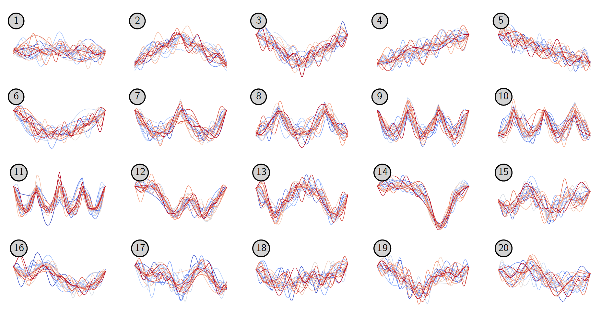
</p>

In this study, we investigate the performance of both simply supported composite beams and ensembles of simply supported composite beams. For the results reported on single beams, we consider evenly spaced supports. For the ensemble results, we leverage the performance of 100 composite beams with randomly generated support locations.

<p align = "center">
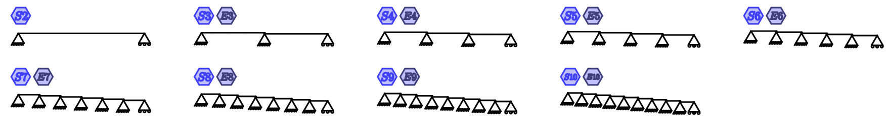
</p>

<p align = "center">

</p>

We also investigate the performance of rectangular domains with varying depth, number of sensors, and with and without full fixity at the bottom of the domain:

<p align = "center">
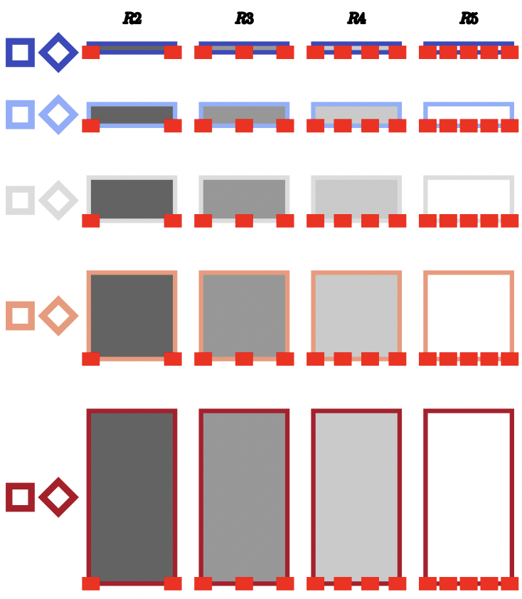
</p>

And, we investigate three lattice domains:

<p align = "center">
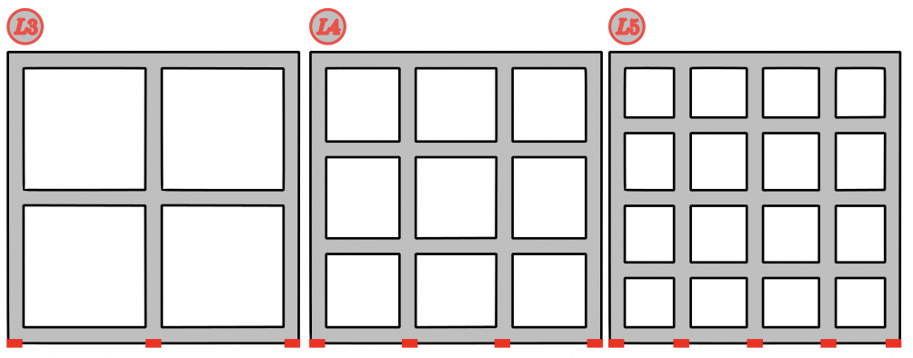
</p>

And three custom domains:

<p align = "center">
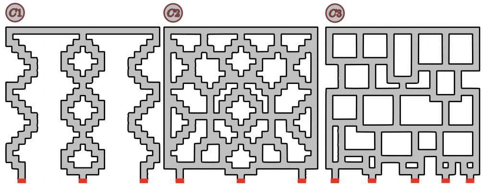
</p>

For all domains considered as mechanical hash functions, we investigate two key aspects of locality sensitive hashing: (1) Spearman's $\rho$ to measure the correlation between distances of the original input loads and the hash values, and (2) functional classification accuracy, where we assess load class prediction based on the hash values.

To reproduce the simulations in our paper, run this script:

```bash
python3 reproduce_paper_simulation_runs.py
```

This script will do the following:
* sample all loads
* create meshes of the rectangular domains
* create meshes of the lattice domains
* create meshes of the custom domains
* run FEA simulations of rectangular domains
* run FEA simulations of lattice domains
* run FEA simulations of custom domains
* run simulations of simply supported domains
* run simulations of ensemble simply supported domains

Please note that: (1) individual steps can be disabled by changing the keywords at the start of the script, and (2) rather than running thousands of simulations in series, we instead run all simulations via ``qsub`` scripts on our workstation.

Fo reproduce the analysis in our paper, run this script: 

```bash
python3 reproduce_paper_simulation_analysis.py
```

This script will do the following:
* sample all loads
* compute classification accuracy based on original input loads
* compute classification accuracy and Spearman's $\rho$ based on simply supported domains
* compute classification accuracy and Spearman's $\rho$ based on ensemble simply supported domains
* compute classification accuracy and Spearman's $\rho$ based on rectangular domains
* compute classification accuracy and Spearman's $\rho$ based on lattice domains
* compute classification accuracy and Spearman's $\rho$ based on custom domains
* compute collision probabilites with respect to input distance for rectangular domains


These scripts call functions organized across the following files:
* ``applied_loads.py``
* ``mesh_generation.py``
* ``problem_setup_fcns.py``
* ``fea_simulation.py``
* ``simply_supported_beams.py``
* ``FEA_code_for_workstation_rectangle.py``
* ``FEA_code_for_workstation_lattice.py``
* ``FEA_code_for_workstation_custom.py``


The key FEA results required to reproduce our analysis (computed on our workstation) are contained in the folder ``FEA_results_summarized`` and are organized as follows:
```
|____FEA_results_summarized/
|           |___depth_num%i_sensor_num%i_fixed_whole_bottom0.txt
|           |___depth_num%i_sensor_num%i_fixed_whole_bottom1.txt
|           |___grid_25x25_device1.txt
|           |___grid_25x25_device2.txt
|           |___grid_25x25_device3.txt
|           |___lattice_3.txt
|           |___lattice_4.txt
|           |___lattice_5.txt
```
where ``depth_num`` ranges from ``1-5`` and ``sensor_num`` ranges from ``2-5`` for the rectangular domains.

Finally, to regenerate the figures in our manuscript, run the following scripts:
* ``reproduce_paper_fig_1.py``
* ``reproduce_paper_fig_2.py``
* ``reproduce_paper_fig_3.py``
* ``reproduce_paper_fig_4.py``
* ``reproduce_paper_fig_5.py``
* ``reproduce_paper_fig_5_table.py``
* ``reproduce_paper_confusion_matrix.py``

Note: the figures refer to the figures in our manuscript, linked below.

For context, all folders contained in the ``reproduce_paper_results`` folder are as follows:

| name | purpose |
| -----| ------- |
| ``analysis_results`` | all analysis results needed to generate paper figures |
| ``FEA_mesh`` | generated FEA meshes to run the FEA simulations |
| ``FEA_results_custom_workstation`` | all results generated by running the FEA custom simulations |
| ``FEA_results_lattice_workstation`` | all results generated by running the FEA lattice simulations |
| ``FEA_results_rectangle_workstation`` | all results generated by running the FEA rectangle simulations |
| ``FEA_results_summarized`` | the minimum information from all FEA results to run the analysis |
| ``figures`` | all files to reproduce figures in the paper, including computer generated plots and hand illustrated figures |
| ``qsub_scripts_BU_workstation`` | the qsub scripts used to run these simulations on the BU workstation (will likely not work on others) |
| ``SS_results_summarized`` | summary of simply supported beam results |
| ``table`` | data to inform table 1 in the appendix of the manuscript |

All python files contained in the ``reproduce_paper_results`` folder are as follows:

| name | purpose |
| -----| ------- |
| ``applied_loads.py`` | functions to recreate the applied loads |
| ``FEA_code_for_workstation_custom.py`` | wrapper for functions in ``fea_simulation.py`` specific to custom domains |
| ``FEA_code_for_workstation_lattice.py`` | wrapper for functions in ``fea_simulation.py`` specific to lattice domains |
| ``FEA_code_for_workstation_rectangle.py`` | wrapper for functions in ``fea_simulation.py`` specific to rectangular domains |
| ``fea_simulation.py`` | function to run a FEA simulation with FEniCS |
| ``mesh_generation.py`` | functions to generate FEA meshes with mshr |
| ``problem_setup_fcns.py`` | additional functions to process and analyze data |
| ``reproduce_figure_fcns.py`` | additional functions for formatting data for plotting and illustration |
| ``reproduce_paper_confusion_matrix.py`` | script to reproduce appendix Fig. 9 |
| ``reproduce_paper_fig_1.py`` | script to help create Fig. 1 |
| ``reproduce_paper_fig_2.py`` | script to help create Fig. 2 and appendix Fig. 6 |
| ``reproduce_paper_fig_3.py`` | script to help create Fig. 3 and appendix Fig. 7|
| ``reproduce_paper_fig_4.py`` | script to generate Fig. 4 and appendix Fig. 8 |
| ``reproduce_paper_fig_5_table.py`` | script to organize the data in Table 1, a supplement to Fig. 5 |
| ``reproduce_paper_fig_5.py`` | script to generate Fig. 5 |
| ``reproduce_paper_simulation_analysis.py`` | script to run all analysis for the paper |
| ``reproduce_paper_simulation_runs.py`` | script to run all simulations for the paper |
| ``simply_supported_beams.py`` | script with functions to simulate composite simply supported beams |
| ``test_simply_supported_beams.py``| script to validate results with analytical solutions|

## References to Related Work <a name="references"></a>

This GitHub repository was created to accompany our pre-print:
* LINK TO BE POSTED


## Contact Information <a name="contact"></a>

For information about this project, please get in touch with [Emma Lejeune](https://www.bu.edu/eng/profile/emma-lejeune/). We are interested in establishing further collaborations on this topic.
